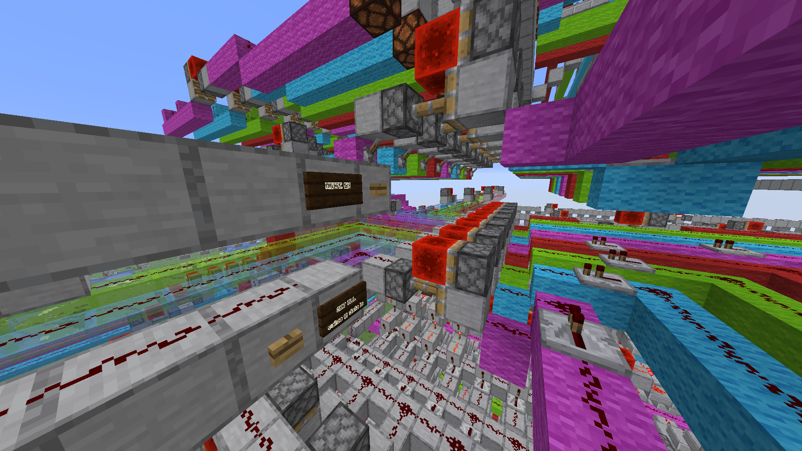
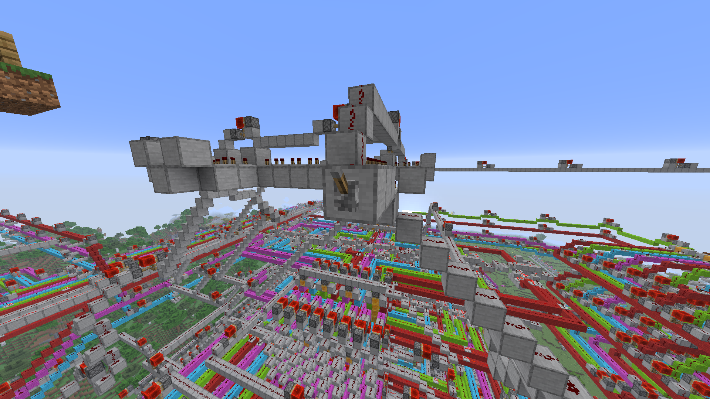

# Minecraft Computer
Hello! This repository contains the world folder, and some instructions to get you up and and running with the Minecraft computer.

_Generating the fibonacci sequence in hexadecimal form until 233 (forgot to display the first two terms, significantly sped up)_

## Specs
Clock frequency: slow

RAM: 128 Bytes

## Writing a Program
### Registers
A register is simply a storage element. They are like variables, in that you can store any 8-bit value in them. This computer provides 4 registers for you to use. I gave them labels `r0`, `r1`, `r2`, and `r3`. Just try not to get mixed up between the numbers. 

### The Program Counter
This is a special register which stores the RAM address of the next instruction to perform. When the computer starts up, the program counter starts at 0, and increments by 3 at each `fetch` of the fetch-execute cycle.

### The Instruction Set
The first step towards getting something running on the computer is to write the program in assembly. Later on when we actually load the program in the computer's memory, this will make it easier to pick the correct binary pattern for an instruction.

The instruction set provides 14 different instructions, many of which can optionally take in an immediate value (a value inputted literally). Here are the available choices:

Note: `rb/immediate` means that you can either use a register or an immediate for this operand.

- `SLL ra rb/immediate rc` - Bit shift `ra` to the left by `rb/immediate` bits, store output in `rc`
- `ADD ra rb/immediate rc` - Adds `ra` and `rb/immediate`, stores the sum in `rc`
- `SUB ra rb/immediate rc` - Same thing as ADD except it subtracts
- `XOR ra rb/immediate rc` - Bitwise XOR between `ra` and `rb/immediate`, store the result in `rc`
- `OR ra rb/immediate rc` - Bitwise OR between `ra` and `rb/immediate`, store the result in `rc`
- `AND ra rb/immediate rc` - Bitwise AND between `ra` and `rb/immediate`, store the result in `rc`
- `SRL ra rb/immediate rc` - Bit shift `ra` to the right by `rb/immediate` bits, store output in `rc`
- `STORE ra rb/immediate` - Stores in the RAM address of `ra`, the value of `rb/immediate` 
- `LOAD ra rb` - Reads the value stored at the RAM address of `ra` into `rb`
- `BEQ ra rb immediate` - Adds `immediate` to the program counter if `ra` and `rb` are equal, otherwise we proceed regularly. (Or in other words, branch if equal).
- `BLT ra rb immediate` - Branch if less than
- `BGT ra rb immediate` - Branch if greater than
- `JMP immediate` - Adds `immediate` to the program counter always (it must be an immediate value).

## Loading a Program
### How the Computer takes in instructions
All computers fetch instructions from the memory address stored in the program counter. Instructions are too big to fit in one byte of memory, so we fetch three bytes instead.

Let's say the program counter points to address 3 in memory.
- The first byte (Byte 0) stores the optional immediate operand
- Byte 1 stores the register operands, and destination register
- Byte 2 stores the operation to perform (ADD, SUB, etc.)

At each retrieval of an instruction, the program counter increments by 3. This is important to remember, as it means that your instructions must begin at addresses that are a multiple of 3 (3, 6, 9, etc.). 

### Encoding an instruction in binary
Here is a table that shows exactly what each instruction maps to in binary:
| Instruction | Binary      |
|--------------|-------------|
| SLL          | 0000 0001   |
| ADD          | 0000 0010   |
| SUB          | 0000 0011   |
| XOR          | 0000 0100   |
| OR           | 0000 0101   |
| AND          | 0000 0110   |
| SRL          | 0000 0111   |
| STORE        | 0001 0000   |
| LOAD         | 0001 0001   |
| BEQ          | 0000 1000   |
| BLT          | 0000 1010   |
| BGT          | 0000 1011   |

You might notice JMP is not listed. That's because it only takes an immediate operand. Each instruction has a counterpart specifically to allow immediate operands, here is the table:

| Instruction | Binary      |
|--------------|-------------|
| SLL_I          | 0010 0001   |
| ADD_I          | 0010 0010   |
| SUB_I          | 0010 0011   |
| XOR_I          | 0010 0100   |
| OR_I           | 0010 0101   |
| AND_I          | 0010 0110   |
| SRL_I          | 0010 0111   |
| STORE_I        | 0011 0000   |
| JMP            | 0010 1011   |

Branching always takes in an immediate operand (for the offset), so it does not have a separate instruction.

### Encoding operands in binary
Ok, we have our instructions, but how do we specify the operands? The byte of memory for operands uses this format:
- The first two bits from the left are unused, they don't do anything.
- The 2nd pair of bits (bit 5 and 4) specifies the register for the first operand
- The 3rd pair of bits (bit 3 and 2) specifies the register for the second operand
- The last pair of bits (bit 1 and 0) specifies the register where the output will be stored.

As an example, lets say we are adding the number stored in register 2, and register 3, and storing the result in register 1. Our byte would look like:

`0010 1101`

Lets say you want to perform an immediate instruction, like incrementing register 3 by 1. Our first operand would be register 3, and our last operand would be register 3 (since thats where the output will be stored), but what about the 1? Immediate values have their own separate byte remember? So we'll just store the operand there in binary.

Our operand byte will look like: `0011 0011`, and our immediate byte will look like: `0000 0001`

Prepare this for each instruction in your program, and then we'll cover loading it into the computer.

### Writing to the Computer's Memory
First, we need to actually get you in the world in Minecraft. To do this: 
1. Download the "world.7z" file in the root folder of this repository.
2. Extract it
3. Move resulting folder to `.minecraft/saves`. If you don't know where .minecraft is:
  - Windows: `C:/Users/<username>/AppData/Roaming/.minecraft`.
  - Mac: `~/Library/Application Support/minecraft`
  - Linux: `~/.minecraft`
4. Load up the world in minecraft, it should have the name "circuits"

Now that you are in the world, copy and paste this message in chat: `/tp <username> -168 133 -109 147.4 12.3`.
You should see this:

- The levers allow you to select an address in memory with the magenta wool being the most significant bit
- The glass wires allow you to decide what will be written to the address. (Place a redstone block on top of the redstone to power it)
- The button labelled "WRITE EN" writes the value you entered on the glass wires to the address you selected
- The button labelled "SET ALL" writes the value you entered on the glass wires to EVERY ADDRESS

When loading your program, keep the following in mind: 
- leave addresses 0-2 zeroed out
- Instructions are always 3 bytes wide, the 1st byte is for the immediate, 2nd for the register operands, and 3rd for the actual operation (ADD, SUB, etc.).
- Because instructions are 3 bytes wide, this means that they must begin at addresses that are multiples of 3 (3, 6, 9, etc.)
- Flip OFF all address levers, and power off all write lines once you're done.

Also, address 127 controls the 7 segment display. Writing a value to that address automatically displays it!

## Running a Program
### The OFF/ON Switch
Enter this command into chat: `/tp <username> -134 139 -136 -60.1 9.5`. This will take you to the ON/OFF switch. After loading your program, don't flip it on yet and instead refer to the next section to start up the clock. After one whole cycle passes, flip on the switch and your program will start running.

To turn the computer off, all you need to do is flip that switch off. Memory is not affected by this, so don't worry about losing your program.

### Starting the Clock
Enter this command into chat: `/tp <username> -86 195 -120 91.3 76.6`. You should see:

This is the clock, all computers run in cycles of:
- fetch (retrieving an instruction from memory)
- decode (figuring out what operation to perform, and the inputs and outputs)
- execute (running and storing the result of the operation).

The clock orchestrates this, a redstone signal travels through the repeaters, and at the end of each section of repeaters, the next phase of the fetch-execute cycle is started.

Now, enter this command into chat: `/tp <username> -84.4 183.6 -130.2 2.0 50.8`. You should be facing a redstone dust. To start the clock, place a redstone block on top of it FOR AT LEAST 2 SECONDS and then break it.

IMPORTANT: Ensure all the address selection levers, and data input lines are off in the memory area before starting the clock.

### The PAUSE Switch
We all make mistakes. To help investigate bugs in your program, I added in a pause switch. Enter this command in chat to reach it: `/tp <username> -77.2 181.7 -130.2 74.2 17.2`. You should see:

Flipping it on will pause the program such that it won't respond to the clock. The clock is still running though so it is up to you to unpause right where the clock left off, otherwise you might experience some undefined behaviour.

